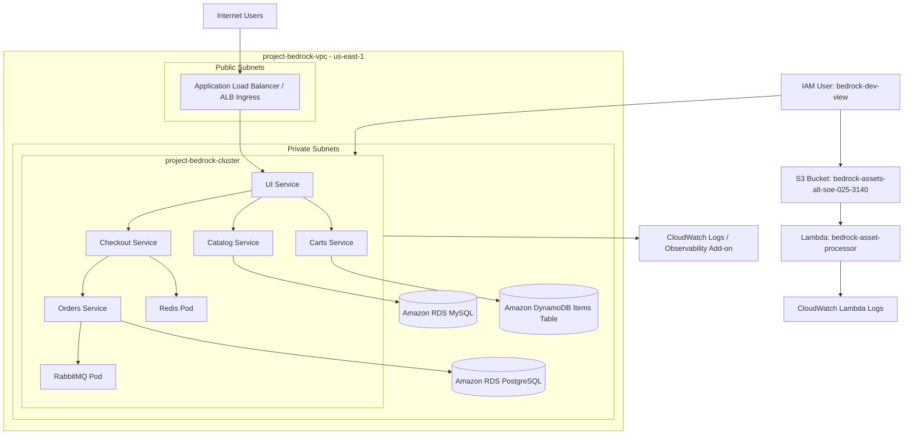

# Project Bedrock – InnovateMart EKS Deployment

## Overview

This project provisions a production-grade AWS EKS environment for the AWS Retail Store Sample App using Terraform, Kubernetes, RDS, DynamoDB, CloudWatch, S3, Lambda, and GitHub Actions CI/CD.

## Architecture



## Key Resources

| Resource | Value |
|---|---|
| AWS Region | `us-east-1` |
| EKS Cluster | `project-bedrock-cluster` |
| VPC | `project-bedrock-vpc` |
| Namespace | `retail-app` |
| S3 Bucket | `bedrock-assets-alt-soe-025-3140` |
| Lambda Function | `bedrock-asset-processor` |
| IAM Developer User | `bedrock-dev-view` |


## Application URL

Retail Store URL:

```text
http://k8s-retailap-retailap-3c6aa53d7a-836497109.us-east-1.elb.amazonaws.com
```
The application is exposed through an AWS Application Load Balancer (ALB) Ingress Controller.

## Data Layer

The application uses managed AWS services for persistence:

- Catalog service → Amazon RDS MySQL
- Orders service → Amazon RDS PostgreSQL
- Carts service → Amazon DynamoDB
- Checkout Redis and Orders RabbitMQ run inside the Kubernetes cluster as permitted by the assignment.

---

## Observability

- EKS control plane logging is enabled.
- Amazon CloudWatch Observability Add-on is installed.
- Fluent Bit and CloudWatch agents are running in the `amazon-cloudwatch` namespace.
- Lambda logs are available in CloudWatch Logs.

## Serverless Extension

Product image uploads are handled through:

S3 Bucket → Lambda Function → CloudWatch Logs

Test upload confirmed Lambda log:

```text
Image received: test-image.txt from bucket: bedrock-assets-alt-soe-025-3140
```

## Secure Developer Access

IAM user `bedrock-dev-view` has:

* AWS `ReadOnlyAccess`
* `s3:PutObject` access to the assets bucket
* Kubernetes read-only access to the `retail-app` namespace

## Verification

```bash
kubectl get pods -n retail-app
```

Result: ✅ Allowed

```bash
kubectl delete pod <pod-name> -n retail-app
```

Result: ❌ Denied


## CI/CD

GitHub Actions workflow:

```text
.github/workflows/terraform.yml
```

## Pipeline Behavior

* Pull Request to `main` runs `terraform plan`
* Terraform plan output is posted as a PR comment
* Push or Merge to `main` runs `terraform apply`
* AWS credentials are stored securely as GitHub repository secrets


## Grading Output

The required grading file has been generated and committed:

```text
grading.json
```

It includes:

* `cluster_endpoint`
* `cluster_name`
* `region`
* `vpc_id`
* `assets_bucket_name`

## Deployment Commands

```bash
git add README.md
git commit -m "Add README and architecture diagram"
git push
```